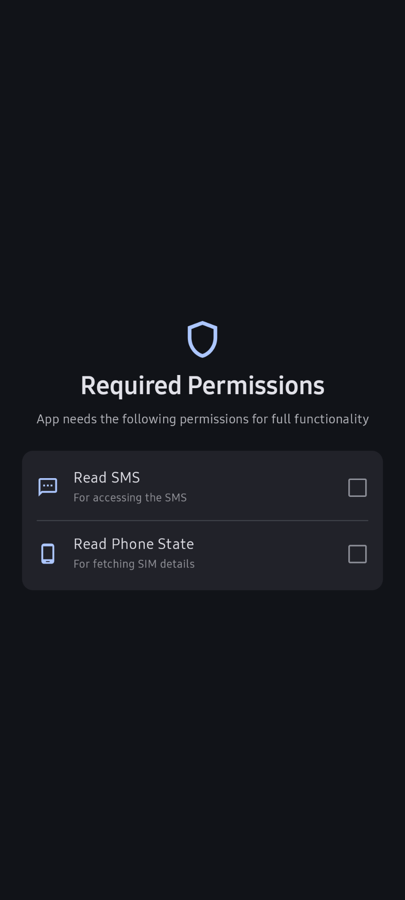
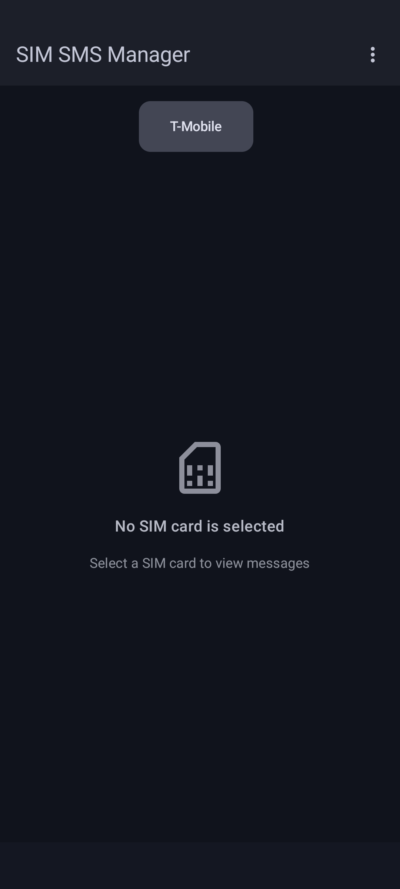
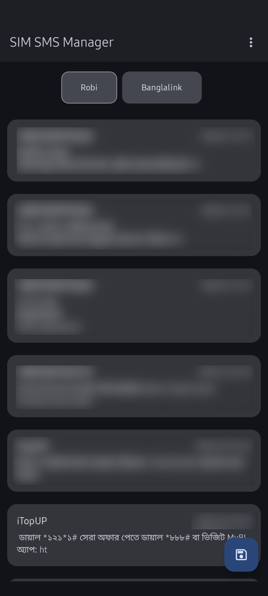
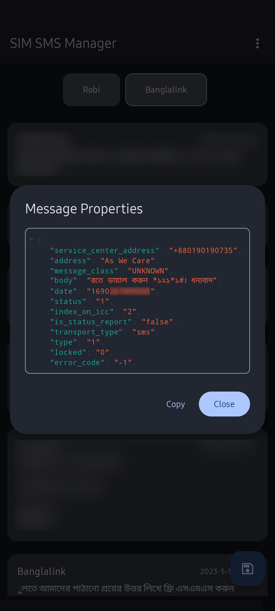
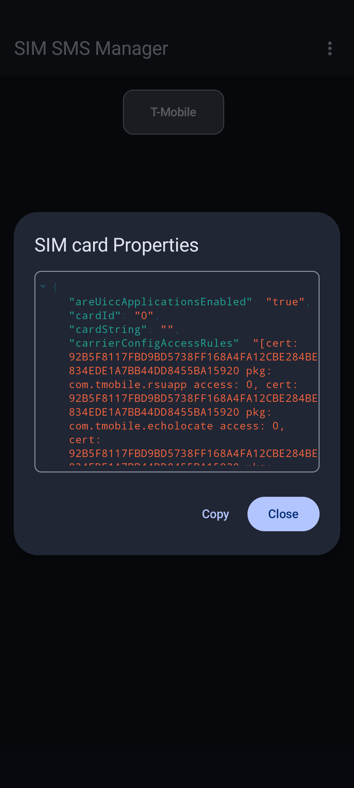
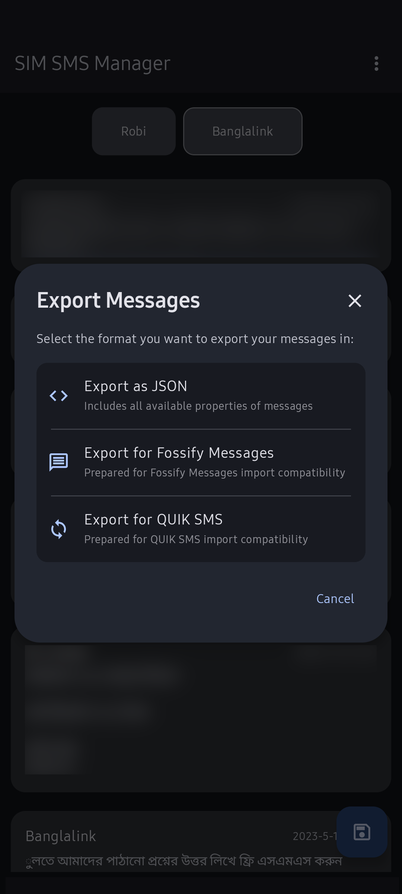

# SIM SMS Manager

A lightweight offline Android app to manage SMS on your SIM card memory.

## Table of Contents

- [SIM SMS Manager](#sim-sms-manager)
  - [Table of Contents](#table-of-contents)
  - [Features ✨](#features-)
  - [Screenshots 📷](#screenshots-)
  - [Permissions 🔐](#permissions-)
  - [Compatibility 📱](#compatibility-)
  - [Installation 📥](#installation-)
  - [Usage 🛠️](#usage-️)
  - [Developing 💻](#developing-)
  - [Contributing 🤝](#contributing-)
  - [License 📜](#license-)

## Features ✨
- **Manage SMS** – Read or Delete messages stored in your SIM memory
- **SIM Details**  – Check ICCID, IMSI, carrier, and more
- **Export SMS** – Compatible with:
  - [Fossify Messages](https://github.com/FossifyOrg/Messages)
  - [QUIK SMS](https://github.com/octoshrimpy/quik)

## Screenshots 📷

<table>
    <tr>
        <td>
            </td>
        <td>
            </td>
        </td>
    </tr>
    <tr>
        <td>
            </td>
        <td>
            </td>
        </td>
    </tr>
    <tr>
        <td>
            </td>
        <td>
            </td>
        </td>
    </tr>
</table>

## Permissions 🔐

| Permission             | Purpose                                                         |
| ---------------------- | --------------------------------------------------------------- |
| READ_SMS               | Access SMS stored on the SIM card for viewing and exporting.    |
| READ_PHONE_STATE       | Retrieve SIM card details like ICCID, IMSI, and carrier info.   |
| WRITE_EXTERNAL_STORAGE | Save export files on devices running Android 9 (Pie) or earlier |

> [!NOTE]  
> For **deleting** a **message**, you need to make this app as your **default SMS app**.

## Compatibility 📱

- Android 5.1+
- Exports compatible with Fossify Messages and Quik SMS apps.

## Installation 📥

- Download the latest APK from [Releases](https://github.com/kurtnettle/sim-sms-manager/releases).
- Install the APK on your Android device. You may need to enable "Unknown Sources" in your device settings during this step.
- Grant necessary permissions.
  * **Note for Android 15 users:** You may require to allow "Restricted Settings" from the App Info for this app.

## Usage 🛠️

1. **Viewing Messages**:
   - Select a SIM card to load messages
   - Tap any message to view further details

2. **Deleting Messages**:
   - Tap and hold the message you want to delete. (You may need to make this app default SMS app to delete a message)

3. **Viewing SIM card details**:
   - Tap and hold the SIM card name to the view details of the SIM card

4. **Exporting Messages**:
   - Click the floating button at the bottom right.
   - Tap on the export format you prefer.
   - Check your **Downloads** folder for the exported file.

## Developing 💻

1. Open Android Studio and put the repo url

2. Commit your changes

3. Build the project

4. Run on device 🚀

## Contributing 🤝

I welcome contributions from the community! To contribute, please follow these steps:

1. **Fork the Repository:** Create your own copy.

2. **Open an Issue:** Report bugs or suggest features.

3. **Submit a Pull Request:** Ensure your code is well-tested and follows project standards.

## License 📜

This project is licensed under the **GNU General Public License v3.0 (GPLv3)**. See
the [LICENSE](LICENSE) file for full details.

By contributing, you acknowledge that your submissions will also be licensed under **GPLv3**.